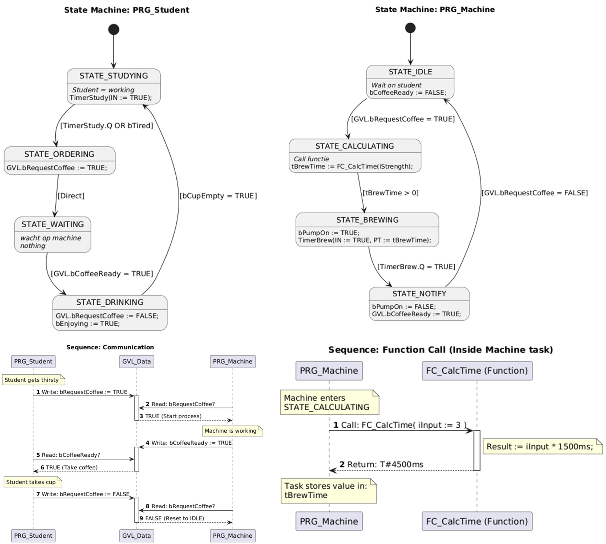

# Ontwerp

The diagrams are made in Plantuml.

## Diagrams

To visualize the software design, the following diagrams are presented in Figure 1:

- **State Machines:** Two diagrams showing the internal logic for the Student and the Machine.
- **Communication Sequence:** A diagram depicting the data exchange between the independent tasks.
- **Function Call:** A sequence diagram detailing the usage of the specific function.

*Figure 1: Overview of State Machines and Sequence Diagrams*

## Communicatie
All tasks use the Global variable list for communication. For example:How strong the coffee is.
